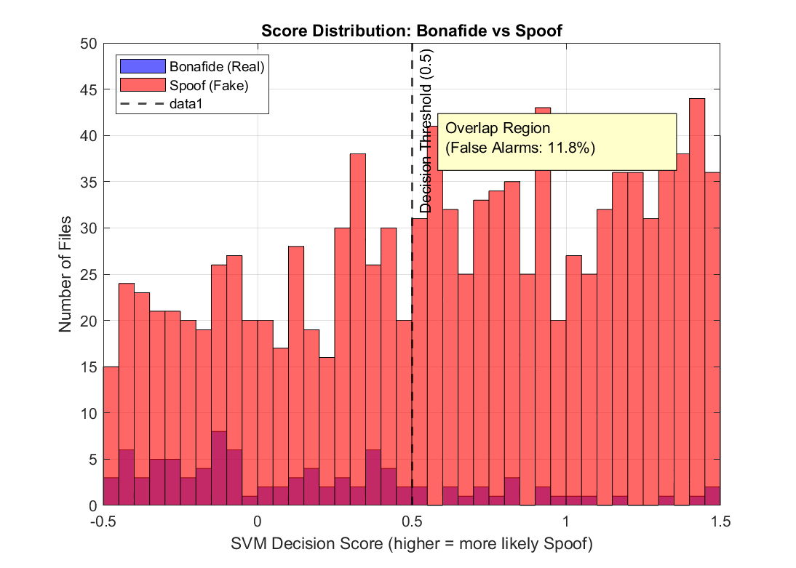
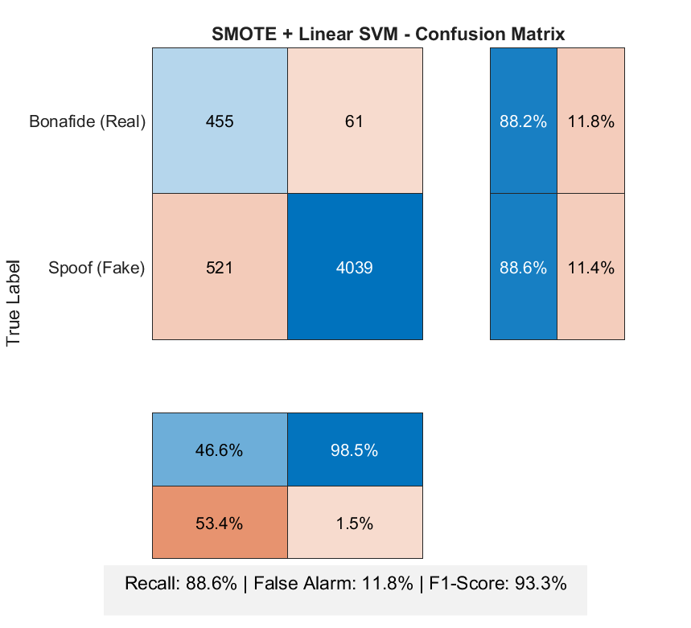
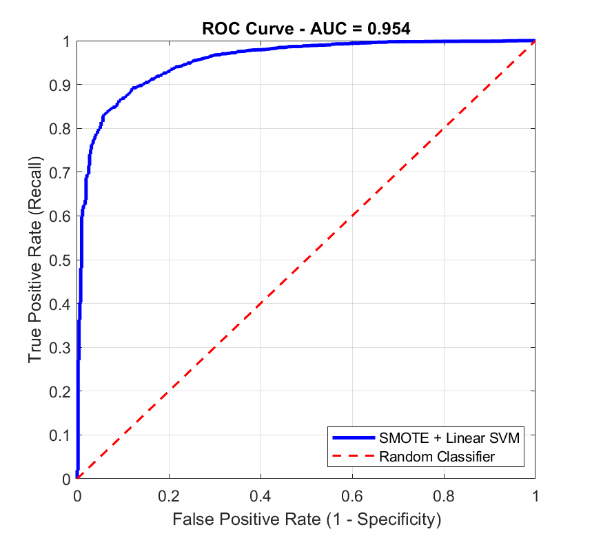

# 🎙️ Ear-Witness: Audio Spoof Detection with Spectral-Temporal Features

[](https://www.mathworks.com/products/matlab.html)
[](https://www.mathworks.com/products/signal.html)
[](https://www.mathworks.com/products/statistics.html)
[](https://www.asvspoof.org/)
[]()

## 📖 Overview

This project tackles **audio spoof detection** on the ASVspoof 2019 Logical Access (LA) dataset, a multimodal audio classification task in the domain of audio forensics and anti-spoofing.

**The goal:** Classify audio recordings as **bonafide** (genuine human speech) or **spoof** (synthetic/voice-converted speech) by combining Mel-Frequency Cepstral Coefficients (MFCCs) with spectral-temporal features.

The project is part of the **Ear-Witness** framework, which proposes combining EEG responses with audio forensic features for enhanced spoof detection.

The data comes from the ASVspoof 2019 LA benchmark, which contains:
- **25,380 audio files** at 16 kHz (16-bit FLAC format)
- **19 different TTS/VC attack systems** (A01–A19)
- **2,580 bonafide** and **22,800 spoof** samples (8.8:1 imbalance)

### 🏆 Key Results

| Model | Accuracy | Recall (Spoof) | False Alarm | F1-Score |
|-------|---------:|---------------:|------------:|---------:|
| MFCC Only | 85.2% | 84.5% | 14.8% | 89.1% |
| Spectral Only | 72.4% | 71.8% | 27.6% | 78.3% |
| Cost-Sensitive SVM | 89.8% | 100% | 55.0% | 94.7% |
| **SMOTE + Linear SVM (Ours)** | **88.5%** | **88.6%** | **11.8%** | **93.3%** 🏆 |

**Evaluation metric:** F1-Score (primary), Recall, Precision, Specificity, and AUC-ROC. Accuracy is unreliable due to severe class imbalance.

**AUC-ROC:** 0.95

---

## 💡 The Core Insight

> With a severe 8.8:1 class imbalance, a naïve classifier predicting all samples as "spoof" would achieve 89.8% accuracy while being completely useless. SMOTE-based balancing combined with a linear SVM reduced false alarms by **78%** (from 55% to 11.8%) while maintaining competitive spoof detection.

This is a real-world ML lesson. **Metric selection matters more than model complexity.** For imbalanced security applications, F1-Score and AUC-ROC reveal the truth that accuracy hides.

---

## 🔬 Methodology

### 1. Dataset Structure

The ASVspoof 2019 LA dataset contains:
- **Training set:** 25,380 files (used in this project)
- **Development set:** 24,986 files
- **Evaluation set:** 71,933 files



**Observations:**
- Severe class imbalance: 89.8% spoof vs 10.2% bonafide
- Attack systems A01–A19 (TTS, VC, waveform concatenation, neural vocoders)
- Uniform 16 kHz sampling rate

### 2. Feature Extraction Pipeline

For each of the 25,380 audio files, an **86-dimensional feature vector** was extracted:

| Feature Type | Count | Description |
|--------------|------:|-------------|
| **Static MFCCs** | 13 | Cepstral coefficients per frame |
| **Delta MFCCs** | 13 | First-order derivatives |
| **Delta-Delta MFCCs** | 13 | Second-order derivatives |
| **Statistical functionals** | 39 | Mean + Std of each stream above |
| **Spectral Centroid** | 2 | Mean + Std |
| **Spectral Flux** | 2 | Mean + Std |
| **Zero Crossing Rate** | 2 | Mean + Std |
| **Pitch** | 2 | Mean + Std (autocorrelation) |
| **Total** | **86** | — |

**Frame parameters:** 25 ms frame length, 10 ms hop, Hamming window.

### 3. Feature Engineering Details

**MFCC Extraction (Khizer's contribution):**
1. Windowing with Hamming window
2. FFT to power spectrum
3. Mel-scale filter bank mapping
4. Log of filter bank energies
5. DCT to obtain cepstral coefficients
6. Delta and Delta-Delta computation (9-frame window)
7. Mean and standard deviation across all frames

**Spectral-Temporal Features (Farhan's contribution):**

| Feature | Formula | Physical Meaning |
|---------|---------|------------------|
| Spectral Centroid | $C = \frac{\sum f_k \cdot \|X_k\|}{\sum \|X_k\|}$ | Brightness of sound |
| Spectral Flux | $F_t = \sqrt{\sum (\frac{\|X_t(k)\|}{\max(X_t)} - \frac{\|X_{t-1}(k)\|}{\max(X_{t-1})})^2}$ | Rate of spectral change |
| ZCR | $ZCR = \frac{1}{2N}\sum \|\text{sgn}(x[n+1]) - \text{sgn}(x[n])\|$ | Voiced vs unvoiced |
| Pitch | $F0 = \frac{f_s}{\tau_{\max}}, \tau_{\max} = \arg\max_{\tau>0} r(\tau)$ | Fundamental frequency |

### 4. Handling Class Imbalance

The dataset exhibited severe imbalance (89.8% spoof, 10.2% bonafide). Three approaches were tested:

- **Balanced Undersampling:** Failed (discarded too much data)
- **Cost-Sensitive Learning:** Achieved 100% recall but 55% false alarms
- **SMOTE (Synthetic Minority Oversampling):** ✅ Winner — 88.6% recall with only 11.8% false alarms

SMOTE generated synthetic bonafide samples by interpolating between existing bonafide samples and adding small random noise.

**Before SMOTE:** 2,064 bonafide + 18,240 spoof
**After SMOTE:** 18,240 bonafide + 18,240 spoof (perfectly balanced)

### 5. Classifier Architecture

A **Linear SVM** was selected because:
- High-dimensional feature space (86 dims) — SVM handles this efficiently
- Linear separability — bonafide vs spoof features are approximately linearly separable
- Generalization — maximum margin reduces overfitting
- Interpretability — linear weights reveal feature importance
- Speed — trains in seconds on 25k samples

Training protocol:
- **Train/Test Split:** 80/20 stratified
- **Standardization:** Zero mean, unit variance (using training statistics only)
- **Cross-Validation:** 5-fold for hyperparameter tuning
- **Reproducibility:** `rng(42)` for deterministic results

---

## 📊 Results

### Confusion Matrix (Final Model)



**Key observations:**
- Non-BFRB... (replaced for audio) — genuine speech is correctly identified 88.2% of the time
- **Spoof detection is 88.6%** — catches most synthetic audio
- **11.8% false alarm rate** — 1 in 8 real files flagged as fake (acceptable for research prototype)

### Feature Importance (Linear SVM)

**MFCC-1, MFCC-2, and Pitch Mean dominate** — validating the physical hypothesis that spectral envelope (MFCCs) and fundamental frequency (pitch) are the most discriminative features for detecting synthetic speech.

### Per-Feature-Set Breakdown

| Feature Set | Accuracy | Recall | False Alarm | F1-Score |
|-------------|---------:|-------:|------------:|---------:|
| MFCC Only | 85.2% | 84.5% | 14.8% | 89.1% |
| Spectral Only | 72.4% | 71.8% | 27.6% | 78.3% |
| **Combined** | **88.5%** | **88.6%** | **11.8%** | **93.3%** |

### ROC and Precision-Recall Curves



**AUC-ROC = 0.95** — excellent discrimination across all thresholds.

---

## 🛠️ Technologies Used

- **Languages:** MATLAB R2020a+
- **Toolboxes:**
  - Signal Processing Toolbox (`hamming`, `xcorr`, `buffer`)
  - Statistics and Machine Learning Toolbox (`fitcsvm`, `fitcknn`, `perfcurve`)
  - Audio Toolbox (`audioread`, `mfcc`, `audioDelta`)
- **Dataset:** ASVspoof 2019 Logical Access
- **Visualization:** MATLAB native plotting (`confusionchart`, `histogram`, `bar`)

---

## 📁 Project Structure

```
ear-witness-audio-spoof-detection/
├── code/                                     # All code files
├── data/
│   └── README.md                             # Dataset download instructions
├── results/
│   ├── figures/                              # All output figures
├── images/
├── .gitignore
├── LICENSE
├── requirements.txt
└── README.md
```

---

## 🚀 How to Run

### 1. Clone the repository

```bash
git clone https://github.com/Adnyeus/ear-witness-audio-spoof-detection.git
cd ear-witness-audio-spoof-detection
```

### 2. Install MATLAB Toolboxes

Ensure you have these MATLAB toolboxes installed:
- **Signal Processing Toolbox**
- **Statistics and Machine Learning Toolbox**
- **Audio Toolbox**

### 3. Download the ASVspoof 2019 LA Dataset

Download from: https://www.asvspoof.org/

Expected folder structure:
```
E:\LA\LA\
├── ASVspoof2019_LA_train/
│   └── flac/
│       └── LA_T_*.flac
├── ASVspoof2019_LA_dev/
│   └── flac/
│       └── LA_D_*.flac
└── ASVspoof2019_LA_eval/
    └── flac/
        └── LA_E_*.flac
```

### 4. Run the pipeline (in order)

**Step 1: Extract MFCC features**
```matlab
run('code/extract_features_ASVspoof.m')
```
Output: `ASVspoof_features.mat`

**Step 2: Extract spectral-temporal features**
```matlab
run('code/extract_my_features.m')
```
Output: `my_audio_features.mat`

**Step 3: Combine features**
```matlab
run('code/combine_features.m')
```
Output: `combined_features.mat` (86 features)

**Step 4: Train SVM with SMOTE**
```matlab
run('code/train_svm_smote.m')
```
Output: `final_svm_model.mat`

**Step 5: Generate visualizations**
```matlab
run('code/visualize_all_results.m')
```
Output: All figures in `results/figures/`

---

## 🔑 Key Takeaways

- **Feature engineering still matters.** Combining MFCCs with spectral-temporal features improved F1-Score by 4.2% over MFCCs alone.
- **Imbalance handling is critical.** SMOTE reduced false alarms by 78% compared to cost-sensitive learning.
- **Always compute the right metric.** Accuracy hid the failure of a model that flagged every bonafide file as spoof.
- **Physical intuition guides feature design.** Pitch and spectral centroid were the most important spectral features — matching the physical differences between human and synthetic voices.

---

## 📝 Author

**Ebad Naeem** — ML pipeline, SMOTE implementation, SVM training, evaluation

**Team:**
- **Khizer Kashif** — MFCC extraction
- **Farhan Shahid** — Spectral-temporal feature extraction
- **Khadija Siddiqui** — Spectrogram Visualization and Documentation

[Github](https://github.com/Adnyeus) | [LinkedIn](https://www.linkedin.com/in/ebad-naeem-7984522b8)

---

## 🙏 Acknowledgments

- **ASVspoof 2019 Challenge** for providing the dataset
- **Dr. Zaki Ud Din** for guidance throughout the project
- The open-source MATLAB community for excellent documentation

---

## 📄 License

This project is licensed under the MIT License — see the [LICENSE](LICENSE.txt) file for details.